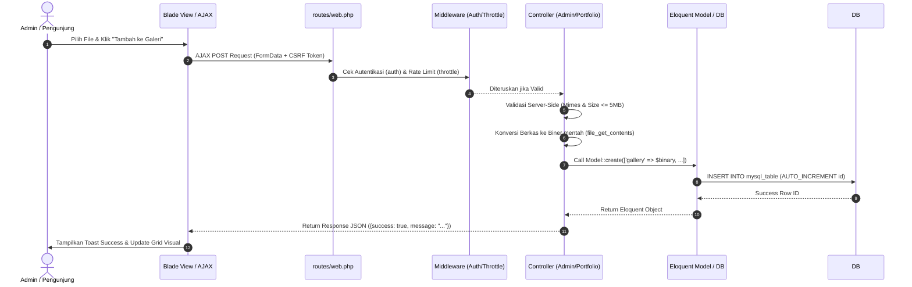

# DOKUMENTASI LENGKAP FUNGSI CONTROLLER, MODEL, DAN VIEW
**Sistem Portofolio Web & Panel Admin (Laravel 12 & MySQL)**

Dokumen ini disusun untuk menjelaskan secara menyeluruh fungsi dari setiap komponen **Controller**, **Model**, dan **View** yang ada pada aplikasi, serta **Mekanisme Kerja Fitur (Alur Sistem MVC)** demi kemudahan pemeliharaan dan transparansi kode.

---

## I. CONTROLLER (`app/Http/Controllers/`)

Controller bertindak sebagai pengatur alur logika bisnis, menerima permintaan (request) dari pengguna, memproses validasi dan manipulasi data melalui Model/Database, serta mengembalikan respon berupa View Blade atau JSON (AJAX).

### 1. `AdminController.php` ([Link File](file:///c:/laragon/www/Portfolio/app/Http/Controllers/AdminController.php))
Controller utama penanggung jawab seluruh pengelolaan konten di dalam panel administrasi.
- **`index()`**: Menghitung jumlah data statistik (pendidikan, pengalaman, skill, pesan) dari MySQL dan menampilkan halaman utama dashboard admin (`admin.dashboard`).
- **`showUbahGambar()`**: Mengambil data seluruh gambar dari tabel `gallery_me` dan `projects_gallery`, lalu menampilkannya pada halaman formulir pengelolaan gambar (`admin.ubah_gambar`).
- **`uploadGambar(Request $request)`**: Validasi masukan berkas (maksimal 5MB, format JPG/PNG/WEBP), membaca biner file (`file_get_contents`), dan menyimpannya ke dalam kolom `hero_image_blob` atau `about_image_blob` pada tabel `profile`.
- **`uploadGallery(Request $request)`**: Memvalidasi foto galeri aktivitas baru dan menyimpannya sebagai data biner (BLOB) ke dalam tabel `gallery_me`.
- **`deleteGallery($id)`**: Menghapus data foto galeri aktivitas dari tabel `gallery_me` berdasarkan ID setelah memverifikasi autentikasi pengguna.
- **`uploadProjectsGallery(Request $request)`**: Memvalidasi foto galeri proyek baru dan menyimpannya sebagai data biner (BLOB) ke dalam tabel `projects_gallery`.
- **`deleteProjectsGallery($id)`**: Menghapus data foto galeri proyek dari tabel `projects_gallery` berdasarkan ID secara asinkron.

### 2. `AuthController.php` ([Link File](file:///c:/laragon/www/Portfolio/app/Http/Controllers/AuthController.php))
Controller penanggung jawab autentikasi dan keamanan akses administrator.
- **`showLogin()`**: Menampilkan formulir halaman masuk (`admin.login`). Jika pengguna sudah login, otomatis dialihkan ke halaman dashboard.
- **`login(Request $request)`**: Memvalidasi masukan username & password, melakukan verifikasi Hash bcrypt, mengamankan sesi dari serangan *Session Fixation* (`session()->regenerate()`), dan mengembalikan respon JSON untuk pengalihan AJAX.
- **`logout(Request $request)`**: Menghentikan sesi aktif, meregenerasi token CSRF untuk mencegah eksploitasi, dan mengembalikan pengguna ke halaman login.
- **`dashboard()`**: Memastikan pengecekan hak akses sebelum menampilkan view dashboard.

### 3. `PortfolioController.php` ([Link File](file:///c:/laragon/www/Portfolio/app/Http/Controllers/PortfolioController.php))
Controller utama penampil halaman beranda depan portofolio publik.
- **`index()`**: Menarik data profil, riwayat pendidikan, pengalaman kerja, keahlian, data galeri aktivitas (`gallery_me`), serta galeri proyek (`projects_gallery`) dari database MySQL untuk dirender secara dinamis ke `portfolio.blade.php`.
- **`serveGalleryImage($id)`**: Menyajikan berkas biner (BLOB) dari tabel `gallery_me` secara langsung sebagai gambar HTTP response dengan header `Content-Type: image/jpeg` dan *cache-control*.
- **`serveProjectsGalleryImage($id)`**: Menyajikan berkas biner (BLOB) dari tabel `projects_gallery` secara langsung sebagai gambar HTTP response.

### 4. `Controller.php` ([Link File](file:///c:/laragon/www/Portfolio/app/Http/Controllers/Controller.php))
Kelas abstrak dasar (Base Controller) pada Laravel 11/12 yang diwarisi oleh seluruh controller di aplikasi.

---

## II. MODEL (`app/Models/`)

Model bertindak sebagai representasi objek data dan penghubung langsung dengan tabel pada database MySQL (ORM Eloquent).

### 1. `User.php` ([Link File](file:///c:/laragon/www/Portfolio/app/Models/User.php))
- **Tabel Terkait**: `users`
- **Fungsi**: Mewakili data akun administrator untuk kebutuhan autentikasi masuk.
- **Properti Utama**:
  * `$table = 'users'`
  * `$fillable = ['username', 'password', 'name']`
  * `$hidden = ['password']` (Mencegah pencetakan password mentah di JSON response).

### 2. `Profile.php` ([Link File](file:///c:/laragon/www/Portfolio/app/Models/Profile.php))
- **Tabel Terkait**: `profile`
- **Fungsi**: Menyimpan informasi biodata pemilik portofolio (nama, bio, email, telepon, alamat) serta data biner gambar profil utama (`hero_image_blob` & `about_image_blob`).
- **Properti Utama**:
  * `$table = 'profile'`
  * `$fillable = ['name', 'title', 'bio', 'email', 'phone', 'address', 'profile_pic', 'hero_image_blob', 'hero_image_mime', 'about_image_blob', 'about_image_mime']`
  * `$timestamps = false`

### 3. `GalleryMe.php` ([Link File](file:///c:/laragon/www/Portfolio/app/Models/GalleryMe.php))
- **Tabel Terkait**: `gallery_me`
- **Fungsi**: Menyimpan daftar foto galeri aktivitas personal dalam bentuk data biner BLOB.
- **Properti Utama**:
  * `$table = 'gallery_me'`
  * `$fillable = ['gallery', 'name', 'created_at']`
  * `$timestamps = false`

### 4. `ProjectsGallery.php` ([Link File](file:///c:/laragon/www/Portfolio/app/Models/ProjectsGallery.php))
- **Tabel Terkait**: `projects_gallery`
- **Fungsi**: Menyimpan daftar foto/screenshot karya proyek dalam bentuk data biner BLOB.
- **Properti Utama**:
  * `$table = 'projects_gallery'`
  * `$fillable = ['gallery', 'name', 'created_at']`
  * `$timestamps = false`

---

## III. VIEW BLADE (`resources/views/`)

View bertindak sebagai antarmuka pengguna (User Interface), menyajikan data secara aman, responsif, dan menghadirkan pengalaman visual modern.

### 1. `portfolio.blade.php` ([Link File](file:///c:/laragon/www/Portfolio/resources/views/portfolio.blade.php))
- **Fungsi**: Beranda utama portofolio publik.
- **Cakupan**: Menampilkan bagian Hero, Tentang Saya, Keahlian (Tabel & Progress Bar), Portofolio Proyek, Galeri Aktivitas Dinamis (dari `gallery_me`), Galeri Proyek Dinamis (dari `projects_gallery`), dan Formulir Kontak.
- **Fitur Khusus**: Mendukung *fallback* gambar statis lokal jika tabel database masih kosong.

### 2. `admin/layout.blade.php` ([Link File](file:///c:/laragon/www/Portfolio/resources/views/admin/layout.blade.php))
- **Fungsi**: Template dasar (Master Layout) untuk seluruh halaman di dalam panel admin.
- **Cakupan**: Menyediakan struktur HTML5 semantic, Sidebar Navigasi responsif, CSS Variable design system, Toast Notification global (`showToast`), serta inklusi pustaka jQuery.

### 3. `admin/login.blade.php` ([Link File](file:///c:/laragon/www/Portfolio/resources/views/admin/login.blade.php))
- **Fungsi**: Antarmuka autentikasi masuk admin.
- **Cakupan**: Formulir login interaktif dengan efek Glassmorphism, validasi AJAX real-time, dan indikator loading state.

### 4. `admin/dashboard.blade.php` ([Link File](file:///c:/laragon/www/Portfolio/resources/views/admin/dashboard.blade.php))
- **Fungsi**: Ringkasan statistik cepat panel admin.
- **Cakupan**: Menampilkan 4 kartu statistik (Riwayat Pendidikan, Pengalaman Kerja, Skill, Pesan Masuk) serta tautan aksi cepat.

### 5. `admin/ubah_gambar.blade.php` ([Link File](file:///c:/laragon/www/Portfolio/resources/views/admin/ubah_gambar.blade.php))
- **Fungsi**: Halaman pusat pengelolaan seluruh foto dan galeri database.
- **Cakupan**: 
  1. Kartu pengunggahan Foto Hero & Foto About (Tabel `profile`).
  2. Panel Pengelolaan Galeri Aktivitas (Form upload & Grid hapus asinkron tabel `gallery_me`).
  3. Panel Pengelolaan Galeri Proyek (Form upload & Grid hapus asinkron tabel `projects_gallery`).
  4. Penanganan AJAX jQuery interaktif tanpa perlu reload halaman manual.

---

## IV. MEKANISME KERJA FITUR (ALUR SISTEM MVC)

Berikut adalah urutan alur kerja dari saat pengguna melakukan interaksi hingga data tersimpan dan ditampilkan:

### Penjelasan Langkah-Langkah Alur Kerja:

1. **Inisiasi Client-Side (View & AJAX)**:
   Pengguna memilih berkas gambar di halaman `ubah_gambar.blade.php`. JavaScript/jQuery memvalidasi ukuran file di browser (maksimal 5MB). Saat tombol submit diklik, JavaScript mengemas berkas biner ke dalam objek `FormData` dan mengirimkannya via AJAX POST.
2. **Penyaringan Keamanan (Routing & Middleware)**:
   Request diterima oleh `routes/web.php`. Middleware `auth` memastikan pengguna telah login sebagai admin, dan middleware `throttle:10,1` membatasi maksimal 10 request per menit untuk mencegah eksploitasi.
3. **Validasi & Pengolahan Logika (Controller)**:
   `AdminController` menerima request, melakukan validasi tipe MIME gambar (`jpeg,png,jpg,webp`), lalu membaca isi file sebagai biner mentah (`file_get_contents`).
4. **Penyimpanan Database (Model & MySQL)**:
   Controller memanggil Model Eloquent (`GalleryMe` atau `ProjectsGallery`). Model mengeksekusi perintah SQL `INSERT` ke database MySQL. Kolom `id` otomatis bertambah secara `AUTO_INCREMENT`, dan kolom `created_at` mencatat waktu secara otomatis (`CURRENT_TIMESTAMP`).
5. **Umpan Balik Instan (JSON Response & View Update)**:
   Controller mengembalikan respon `JSON` ke browser. jQuery di sisi client menangkap respon sukses, memperbarui elemen visual (DOM), dan menampilkan notifikasi melayang (*Toast Notification*) tanpa merefresh seluruh halaman web.
6. **Penyajian Gambar ke Pengunjung (Public Stream)**:
   Saat pengunjung membuka halaman utama (`portfolio.blade.php`), `PortfolioController` mengambil data dari database dan menyajikan gambar biner melalui rute khusus (`/gallery/image/{id}`) dengan header `Content-Type: image/jpeg` secara efisien dan cepat.

---
*Dokumen ini dibuat otomatis sebagai panduan arsitektur sistem proyek.*
