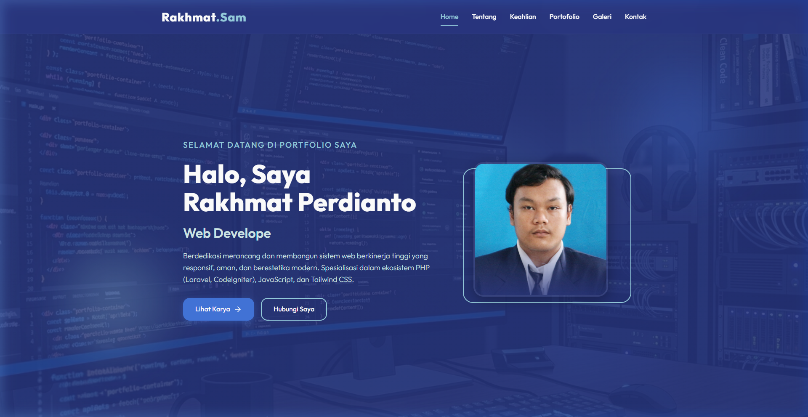
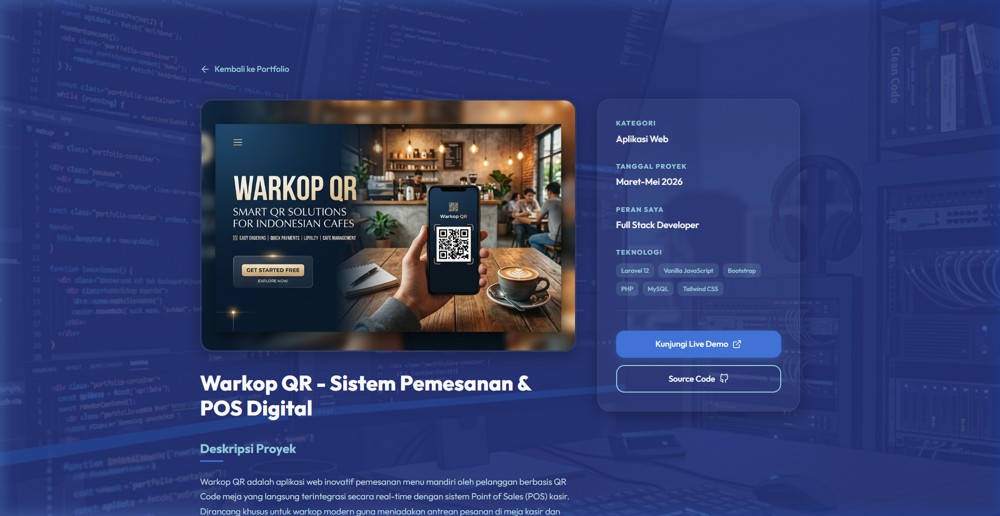
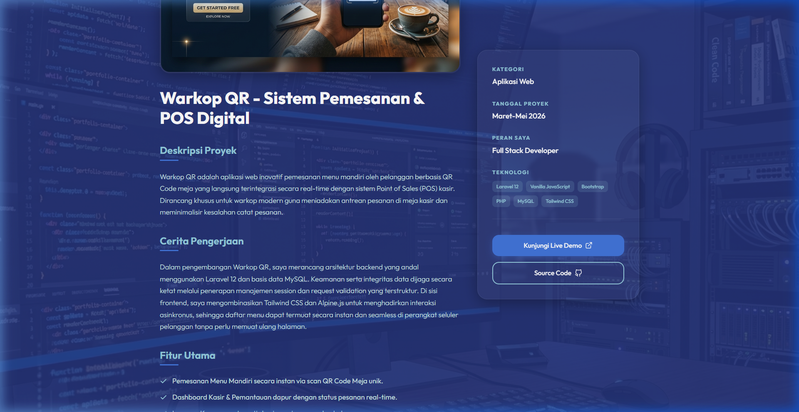

# Rakhmat Perdianto - Portofolio Premium

Selamat datang di repositori portofolio web premium milik **Rakhmat Perdianto**. Website ini dirancang dengan gaya modern, responsif, dan interaktif menggunakan sentuhan efek *glassmorphism*, animasi transisi yang halus, serta tata letak responsif (*fully responsive*) di semua ukuran perangkat.

## 🚀 Fitur Utama

- **Desain Glassmorphic Modern**: Antarmuka transparan dengan efek blur latar belakang dan bayangan lembut untuk kesan futuristik dan bersih.
- **Latar Belakang Gambar Global**: Menggunakan gambar kustom latar belakang (`foto_pribadi/latar_belakang_portfolio.png`) dengan efek *fixed scrolling* (parallax) yang dinamis.
- **Efek Mengetik Otomatis (Typewriter)**: Animasi mengetik dinamis pada bagian pembuka (Hero Section) untuk memperkenalkan peran keahlian secara interaktif.
- **Filter Galeri Proyek**: Fitur filter interaktif berbasis JavaScript untuk mengkategorikan proyek portofolio tanpa memuat ulang halaman (seamless).
- **Detail Proyek Dinamis**: Halaman detail proyek yang memuat informasi cerita pengerjaan, spesifikasi teknologi, serta fitur secara dinamis berdasarkan parameter URL.
- **Galeri Foto Modal (Lightbox)**: Membuka foto-foto galeri pribadi dalam overlay layar penuh dengan latar belakang redup dan tombol tutup.
- **Formulir Kontak Responsif**: Formulir pesan interaktif dengan validasi langsung dan simulasi notifikasi sukses yang ramah pengguna.
- **Navigasi Sticky & Intersection Observer**: Navigasi cerdas yang mendeteksi posisi scroll pengguna dan secara otomatis memberikan efek aktif pada menu navigasi yang sedang dibaca.

## 🛠️ Teknologi yang Digunakan

- **Struktur & Konten**: HTML5 (Struktur Semantis)
- **Desain & Animasi**: Vanilla CSS3 (Variabel CSS, Grid Layout, Flexbox, Media Queries)
- **Logika & Interaktivitas**: Vanilla JavaScript (ES6+, Intersection Observer API, URLSearchParams)
- **Aset & Ikon**: Gambar PNG lokal kustom (Instagram, YouTube, GitHub, LinkedIn, Email, dan Lokasi) untuk menjamin kualitas rendering ikon yang stabil.

---

## 📷 Dokumentasi Tampilan Antarmuka (Visual Showcase)

Berikut adalah dokumentasi tampilan antarmuka halaman portofolio dari hasil pengujian visual:

### 1. Halaman Beranda Utama (Hero Section)
Tampilan awal halaman beranda dengan nama, perkenalan diri, typewriter effect, serta foto utama dengan aksen gradasi yang menarik di atas latar belakang gambar fixed.



---

### 2. Bagian Konten Beranda (Scrolled View)
Ketika halaman digulir ke bawah, konten melayang di atas gambar latar belakang yang tetap diam (*fixed background*). Bagian ini memuat tabel keahlian responsif dengan bar kemajuan (*progress bar*) yang memanjang saat masuk ke layar.


---

### 3. Halaman Detail Proyek (Project Detail Page)
Halaman detail proyek yang menampilkan banner proyek, deskripsi lengkap, kisah pengerjaan, list fitur utama dengan ikon centang, serta info sidebar kustom yang responsif. Latar belakang gambar global terwarisi secara konsisten dan transparan.



---

### 4. Bagian Konten Detail Proyek (Scrolled View)
Halaman detail proyek ketika di-scroll ke bawah, memperlihatkan list fitur yang rapi, tombol aksi demo, serta bagian footer berlabel kustom.



---

## 📂 Struktur Direktori

```bash
Portfolio/
├── foto_pribadi/          # Direktori aset gambar pribadi & ikon sosial
│   ├── instagram.png
│   ├── youtube.png
│   ├── github.png
│   ├── linkedin.png
│   ├── email.png
│   ├── placeholder.png
│   ├── latar_belakang_portfolio.png
│   ├── screenshot_index_top.png
│   ├── screenshot_index_scrolled.png
│   ├── screenshot_project_detail.png
│   └── screenshot_project_detail_scrolled.png
├── index.html             # Halaman utama portofolio
├── project-detail.html    # Halaman detail proyek dinamis
├── style.css              # Stylesheet kustom utama
├── script.js              # Logika interaktivitas Javascript
├── comment.txt            # Dokumentasi struktur kode & riwayat perubahan
└── README.md              # Dokumentasi proyek (file ini)
```

---
Dibuat dengan ❤️ oleh **Rakhmat Perdianto**.
